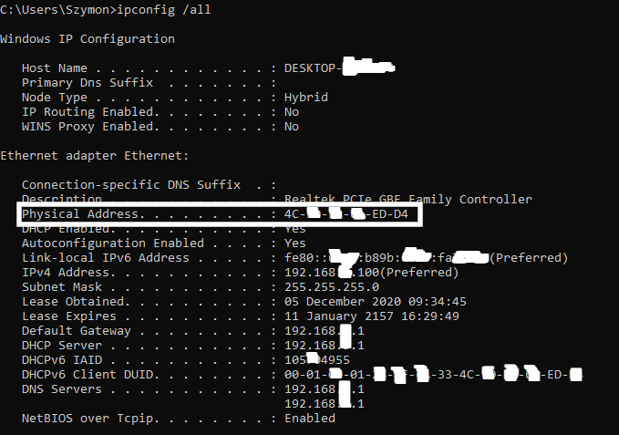
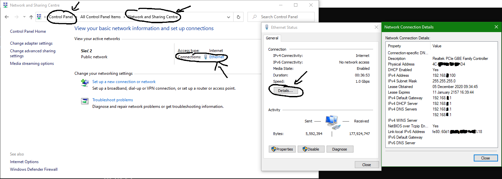
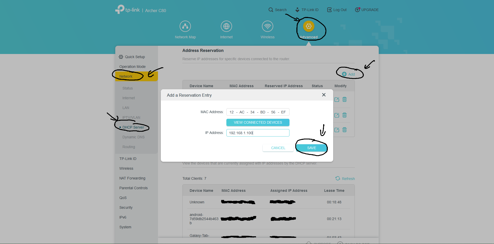
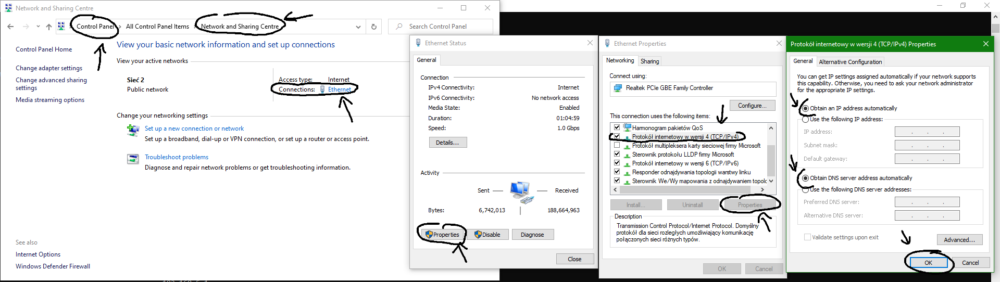
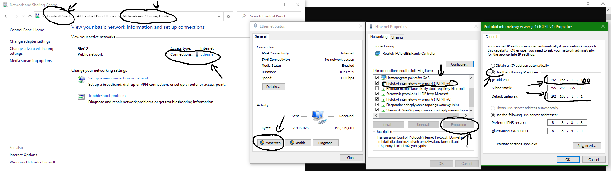
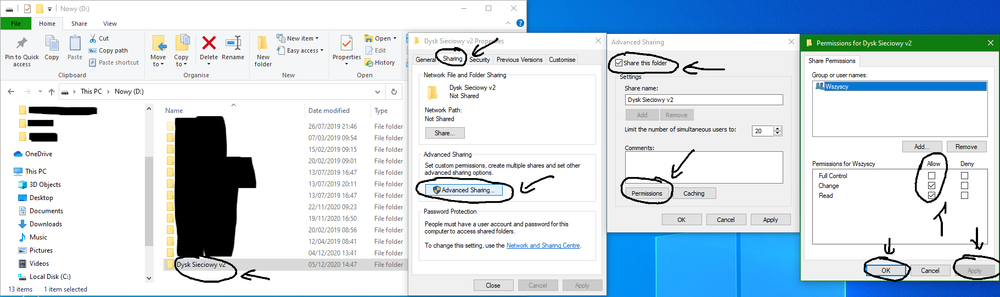
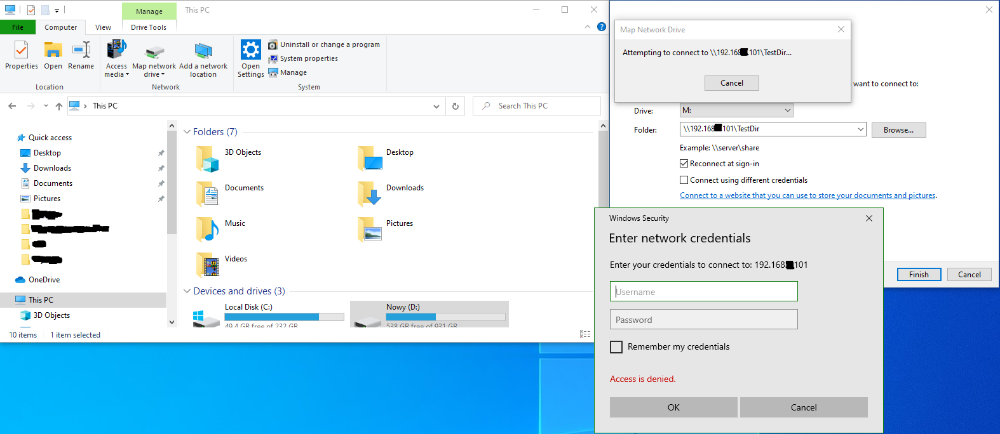
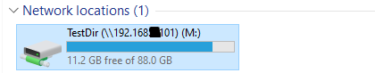

# Tworzenie i mapowanie  w sieci lokalnej

## __Windows__

## 1. Ustawianie statycznego IP routerze dla komputera z dyskiem sieciowym
__UWAGA:__ Pierwsze 3 wartości wybranego adresu IP __muszą__ być zgodne z pierwszymi trzema polami _Bramy domyślnej_ / _Serwera DHCP_; czwarta wartość musi należeć do przedziału od _2 do 254_ (zalecane: _100 - 200_)
* Sprawdź _adres MAC_ swojego urządzenia (karty sieciowej za pomocą której łączysz się z Internetem): 
    * Otwórz __Wiersz poleceń__ (__Command prompt__) i wpisz polecenie _ipconfig /all_, znajdź interfejs za pomocą którego komputer łączy się z internetem i pole _Physical Address_ <br/>
    
    * Alternatywnie: _Panel sterowania > Centrum sieci i udostępniania_, otwórz _Połączenia_, _Szczegóły..._ i znajdź pole _Physical Address_ (_Control panel > Network and Sharing center_, open _Connections_, _Details..._ and check _Physical Address_ field) <br/>
    
    * Niezależnie od wybranej opcji sprawdzania zapamiętaj także pole _DHCP Server_
* Zmień IP na routerze:
    * Otwórz ustawienia routera w przeglądarce (wartość pola _DHCP Server_, np. 192.168.1.1)
    * Zaloguj się (domyślnie username/login: _admin_, password: _admin_)
    * Przypisz statyczny adres IP do adresu MAC swojego urządzenia -
    zależnie od producenta sprzętu sieciowego (TP-LINK, Huawei, Cisco, ...) taka konfiguracja może nazywać się różnie (w razie potrzeby skorzystaj z google)
        * W przypadku TP-LINK Archer C80: _Zaawansowane_ (_Advanced_) >_Sieć_ (_Network_);_Serwer DHCP_ > (_DHCP Server_); w _Rezerwacja adresów_ (_Address Reservation_) dodaj nowe pole, _Zapisz_ (_Save_) <br/>
        

## 2. Ustawianie adresu na karcie sieciowej urządzenia z dyskiem sieciowym
* Jeśli udało Ci się z sukcesem przejść wszystkie kroki zawarte w __pkt. 1.__ wpisz polecenie _ipconfig /all_ i sprawdź czy _IPv4 Address_ twojego urządzenia jest taki sam jak ustawiony na routerze
    * Alternatywnie: _Panel sterowania > Centrum sieci i udostępniania_, otwórz _Połączenia_, _Właściwości_, kliknij w _Protokół internetowy w wersji 4 (TCP/IPv4)_, przycisk _Właściwości_ poniżej i sprawdż czy _Adres IP_ (_IP address_) oraz _Serwer DNS_ (_DNS Server_) są ustawiane na domyślne (automatyczne) wartości <br/>
    
* Jeśli __nie__ udało Ci się z sukcesem przejść wszystkie kroki zawarte w __pkt. 1.__ (eksperymentalne - może nie działać poprawnie):
    * _Panel sterowania > Centrum sieci i udostępniania_, otwórz _Połączenia_, _Właściwości_, kliknij w _Protokół internetowy w wersji 4 (TCP/IPv4)_, przycisk _Właściwości_ poniżej i zmień _Adres IP_ (_IP address_) na wybrany przez siebie adres (patrz: __UWAGA__ w __pkt. 1.__) oraz _Bramę domyślną_ (_Default gateway_) na __istniejącą__ bramę domyślną, którą można sprawdzić przy okazji sprawdzania _Adresu MAC_ w __pkt. 1.__ <br/>
    

## 3. Udostępnianie folderu do sieci lokalnej
* Utwórz folder który chcesz udostępnić w sieci lokalnej. Do folderu warto dodać jakikolwiek plik aby później móc łatwo sprawdzić czy jest on poprawnie udostępniany.
* Kliknij prawym przyciskiem myszy w folder, wybierz _Właściwości > Udostępnianie > Zaawansowane ustawienia udostępniania..._, zaznacz _Udostępnij ten folder_, wejdź do _Uprawnienia_, ustaw dla grupy możliwość wprowadzania zmian (_Modyfikacja_) i odczytu (_Odczyt_) zgodnie z preferencjami
* Wracając klikaj w każdym okienku kolejno _Zastosuj_ i _OK_ <br/>



## 4. Mapowanie dysku sieciowego na urządzeniu z systemem Windows w sieci lokalnej
* Otwórz __Ten Komputer__
* _Mapuj dysk sieciowy_, wybierz literę, pod którą dysk będzie widoczny w komputerze
* W polu _Folder_ podaj: \\\\_IP urządzenia_\\_nazwa folderu_
* Kliknij _Zakończ_
* Zaloguj się nazwą i hasłem użytkownika, który ten folder tworzył <br/>

* Wróć do __Ten Komputer__ i otwórz swój dysk w sekcji _Dyski internetowe_ <br/>



## __Linux (Debian, Ubuntu, Mint, ...)__

## Potrzebne narzędzia
* pakiet _net-tools_: 
    ```
    apt-get install net-tools
    ``` 
*