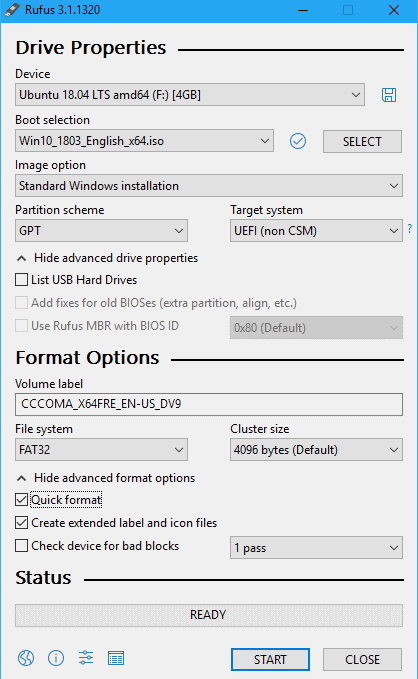
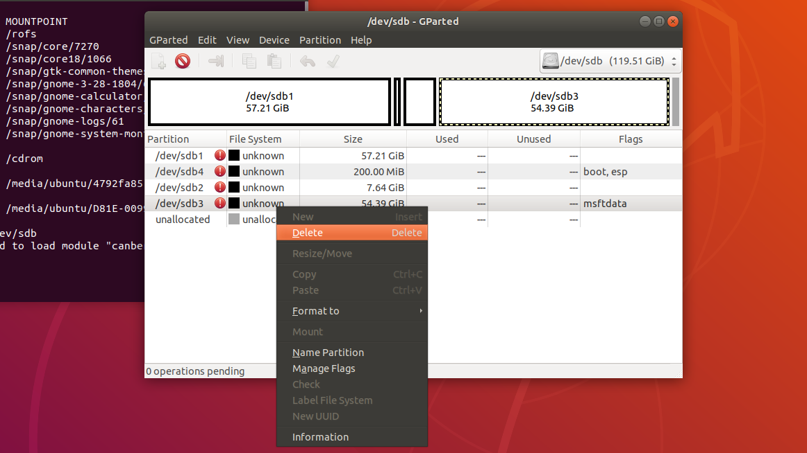
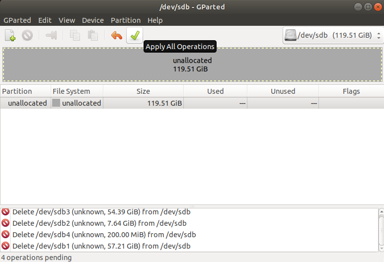
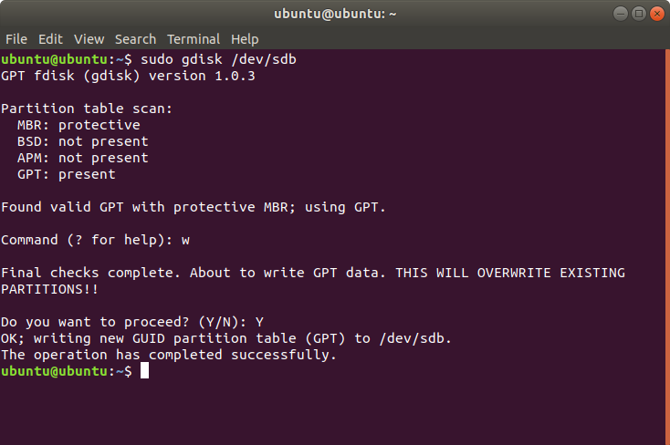
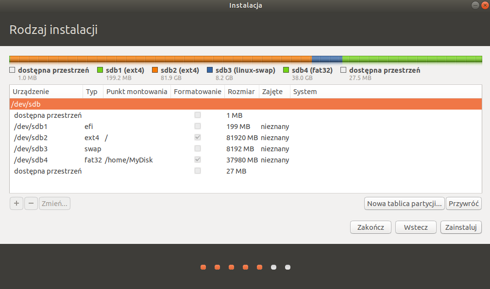
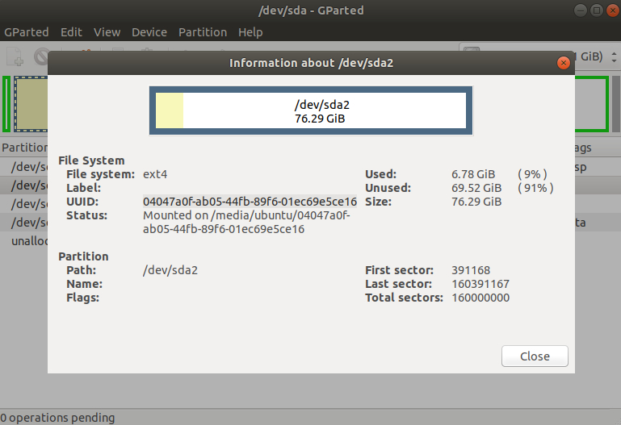
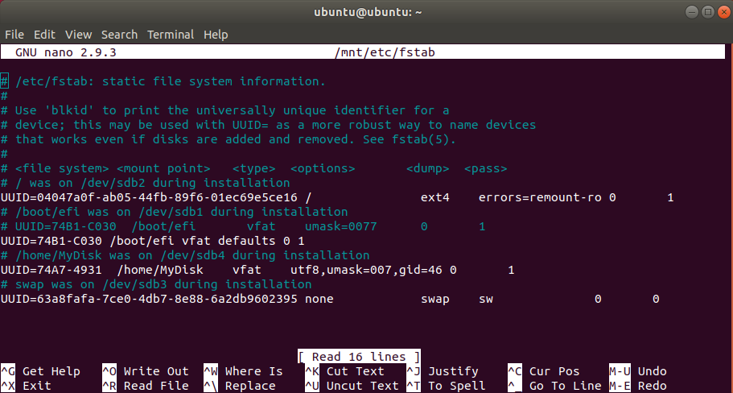
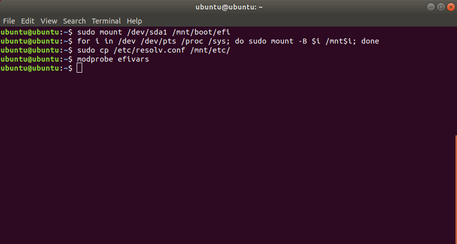
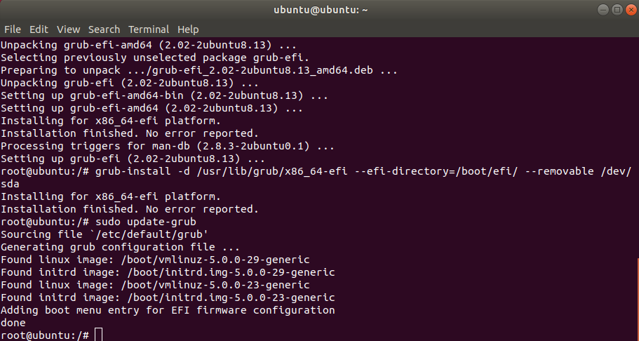

# Instalacja Ubuntu na pamięci USB z możliwością bootowania na dowolnym komputerze

## Wstęp

W tym tutorialu poruszę kwestię instalacji Ubuntu (i pokrewnych dystrybucji Linuxa) w wersji UEFI, na pamięci USB z tablicą partycji GPT.

Ja użyję __Ubuntu 18.04.3 LTS__

## Co jest potrzebne

* Dysk USB / pendrive: min. 8 GB, najlepiej USB3.1 Gen1 lub wyższe
* Pendrive: min. 4 GB, który posłuży nam jako dysk instalacyjny
* Komputer obsługujący UEFI

## 1. Tworzenie dysku instalacyjnego

* Pobierz obraz ISO wybranej dystrybucji linuxa.
* Pobierz program [Rufus](https://rufus.ie/) i uruchom go.
  * W programie wybierz pendrive którego chcesz użyć.
  * Następnie wybierz uprzednio pobrany obraz ISO.
  * Schemat partycjonowania: __GPT__
  * Docelowy system: __UEFI__
  * System plików: __FAT32__
  * Rozmiar jednostki alokacji: __Default__
  * Zaznacz również: szybkie formatowanie, utwórz rozszerzoną nazwę i pliki ikon
* Ostateczne ustawienia powinny wyglądać w ten sposób:



* Następnie kliknij __START__ i w oknie dialogowym zezwól na pobranie dodatkowych plików.

## 2. Przygotowanie dysku USB na którym zainstalujemy Linuxa

### Uruchom ponownie komputer, wejdź w boot menagera i kliknij (UEFI):nazwa_dysku

### W menu zaznacz "Try Ubuntu without installing"

* Dla instalatora w trybie UEFI tło w menu jest czarne (i takie powinno być w naszym przypadku).
* Dla trybu BIOS tło jest purpurowe.

### Formatowanie i usuwanie partycji z dysk USB

* Aby to zrobić musimy uruchomić program __GParted__. Można to zrobić z terminala jak i graficznie.
  * Otwórz terminal: <kbd>Ctrl</kbd> + <kbd>Alt</kbd> + <kbd>T</kbd>  
  * I w terminalu wpisz:  

    ```
    sudo gparted
    ```

* W programie __GParted__ znajdź swój dysk USB przeznaczony do instalacji linuksa. (Na potrzeby tego tutorialu oznaczmy go jako __/dev/sdX__)
* Sformatuj wszystkie partycje (może pojawić się potrzeba odmontowania ich):
  * dla zamontowanych partycji dysku: *PPM > Unmount*
  * dla wszystkich partycji dysku: *PPM > Format to > cleared*
  * __Apply All Operations__  

* Usuń wszystkie partycje: *PPM > Delete*, tak aby cała pamięć na dysku była __*Unallocated*__, ponownie naciśnij __Apply All Operations__ i zamknij __GParted__.




### Zmień tablicę partycji z MBR na GPT (jeżeli nie jest GPT)

* W terminalu wpisz:  

```
sudo gdisk /dev/sdX
```

* Następnie:

```
w
```

* I zatwierdź:

```
Y
```



## 3. Instalacja Ubuntu bez bootloader'a

### Uruchom instalator z wyłączoną instalacją bootloadera wpisując w terminalu

```
ubiquity -b
```

Zaznacz interesujące Cię opcje instalacji dodatkowego software'u. Kiedy instalator poprosi Cię o wybranie rodzaju instalacji zaznacz ostatnią opcję: __Użycie innego rozwiązania__

### Tworzenie partycji dla naszego Linuxa

Znajdź na liście swój dysk USB na którym bedziesz instalować Ubuntu. Następnie stwórz:

1. Partycja __ESP__ - będzie to partycja na której potem zainstalujemy bootloader:

    * Rozmiar od __100 MB__ do __300 MB__
    * Rodzaj partycji: __Partycja EFI (ESP)__ lub jeżeli nie ma takiej opcji to __FAT32__

2. Partycja roota na której zainstalujemy __Linuxa__
    * Rozmiar __min. 5 GB__
    * System plików __ext4__
    * Punkt montowania:
      > `/`

3. Partycja __SWAP__ - Posłuży ona jako dodatkowa pamięć RAM, będzie również przechowywać dane po uśpieniu komputera. Jeżeli brak tych opcji Ci nie przeszkadza możesz pominąć tworzenie tej partycji.
    * Rozmiar
        * W przypadku gdy komputer na którym będziemy używać systemu ma mniej niż 1GB RAMu Partycja ta powinna mieć pojemność dwa razy większą niż ilość RAMu w tym komputerze.
        * Jeżeli nie dotyczy nas ten skrajny przypadek to jej rozmiar powinien być nie mniejszy niż największa konfiguracja RAM na jakiej mamy zamiar kożystać z tego systemu.
    * Rodzaj partycji: __SWAP__

4. Inne partycje
    * Możemy zrobić partycję, która będzie widoczna dla Windows. W takim przypadku wybieramy system plików: __FAT32__ a punkt montowania dowolny. Na przykład:
        > `/home/MyDisk`

    * Można też zrobić osobną partycję dla danych użytkowników naszego systemu, wtedy system plików powinien być ten sam co na partycji z Linuxem a punkt montowania:
        > `/home`

Ponieważ instalacja bootloadera jest wyłączona, na razie nie musimy się o to martwić.
Ja wybrałem, że poza podstawowymi trzema partycjami stworzę partycję z której będę mógł kożystać tak jak z pendriva. Moja konfiguracja wygląda więc tak:



### Naciśnij __Zainstaluj__ i poczekaj na zakończenie instalacji, a następnie wyłącz komputer

## 4. Ręczna instalacja bootloadera (GRUB)

Dysk nie jest bootowalny z UEFI jeżeli nie posiada bootloadera zainstalowanego na partycji EFI. Z tego powodu nie możemy jeszcze uruchomić naszego nowego systemu. Niestety instalacji GRUBa nie da się wykonać z zewnątrz. Więc, aby to obejść musimy zalogować się do nowego Linuksa z dysku instalacyjnego.

### Uruchom ponownie dysk instalacyjny w trybie UEFI, włącz "Try Ubuntu without installing" i upewnij się że masz dostęp do internetu

### Otwórz terminal przy pomocy skrótu <kbd>Ctrl</kbd> + <kbd>Alt</kbd> + <kbd>T</kbd>

* W terminalu wpisz:

    ```
    lsblk
    ```

* Na wyświetlonej liście odnajdź nazwę dysku USB (Nazwa może się różnić tej używanej podczas instalacji). Ponownie na potrzeby tego poradnika oznaczmy go jako __/dev/sdX__. Teraz w terminalu wpisz:

    ```
    sudo gparted /dev/sdX
    ```

* W programie gparted odnajdź partycje z Linuxem kliknij na nią dwa razy i zapisz sobie:
  * Nazwę partycji. *(Nazwijmy ją __/dev/sdXY__)*
  * UUID, np. ***01234567-89ab-cdef-0123-4567890abcde***



* To samo zrób z partycją EFI
  * Nazwę partycji. *(Nazwijmy ją __/dev/sdXZ__)*
  * UUID, np. ***0123-ABCD***
  
* Zamknij GParted

### Teraz należy odmontować partycję Linuksa __/dev/sdXY__ (Jeżeli jest zamontowana) i zamontować ją w innym miejscu

```
sudo umount /media/ubuntu/01234567-89ab-cdef-0123-4567890abcde
sudo mount /dev/sdXY /mnt
```

### Ustawmy nowo zainstalowany system tak aby widział bootloader

```
sudo nano /mnt/etc/fstab
```

* Zakomentuj linię zawierającą "/boot/efi" stawiając przed nią znak __#__. Pod nią zaś dodaj nową linię:

```
UUID=0123-ABCD /boot/efi vfat defaults 0 1
```

* Zapisz zmiany używając kombinacji klawiszy <kbd>Ctrl</kbd> + <kbd>x</kbd> następnie <kbd>Y</kbd> i na końcu <kbd>Enter</kbd>



### Przygotowanie środowiska dla __`chroot`__

__`chroot`__ - to uniksowe polecenie uruchamiające program ze zmienionym katalogiem głównym (root).

Aby z niego skorzystać musimy stworzyć specjalne drzewo katalogów, z zamontowanym ESP i kilkoma dodatkowymi katalogami. Skopiujemy także plik konfiguracyjny *`resolv.conf`*, który da chrootowi dostęp do internetu. Co ważne bootlooader musi być zainstalowany z opcją --removable w trybie ‘Fallback path’ dzięki czemu EFI zawsze będzie w stanie go zauważyć.

### W terminalu wpisujemy

```
sudo mount /dev/sdXZ /mnt/boot/efi  
for i in /dev /dev/pts /proc /sys; do sudo mount -B $i /mnt$i; done  
sudo cp /etc/resolv.conf /mnt/etc/  
modprobe efivars
```



### Uruchamiamy __`chroot`__ oraz pobieramy i instalujemy bootloader (GRUB)

```
sudo chroot /mnt
sudo apt-get install grub-efi
grub-install -d /usr/lib/grub/x86_64-efi --efi-directory=/boot/efi/ --removable /dev/sdX
sudo update-grub
```




## Restartujemy komputer i gotowe :-)

>__Sources:__  
https://www.dionysopoulos.me/portable-ubuntu-on-usb-hdd/  
http://ubuntuhandbook.org/index.php/2014/11/install-real-ubuntu-os-usb-drive/  
https://wiki.gentoo.org/wiki/GRUB2/Troubleshooting  
https://superuser.com/questions/1250895/converting-between-gpt-and-mbr-hard-drive-without-losing-data  
https://askubuntu.com/questions/740253/how-to-install-grub-in-an-external-hard-drive  
http://woshub.com/how-to-repair-deleted-efi-partition-in-windows-7/  
https://www.ubackup.com/windows-10/restore-efi-partition-windows-10-8523.html  
